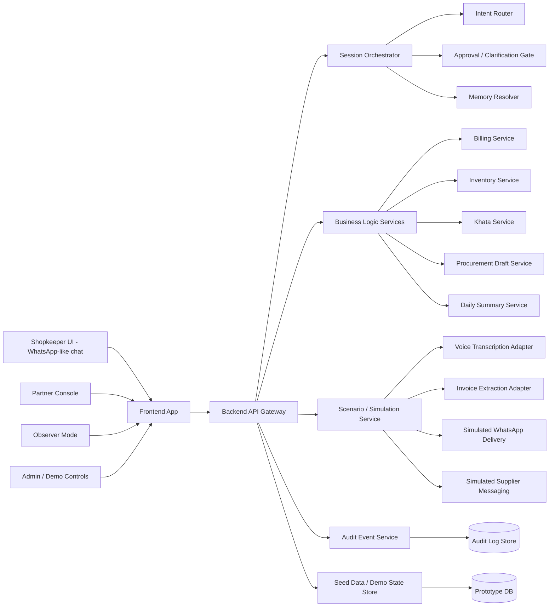
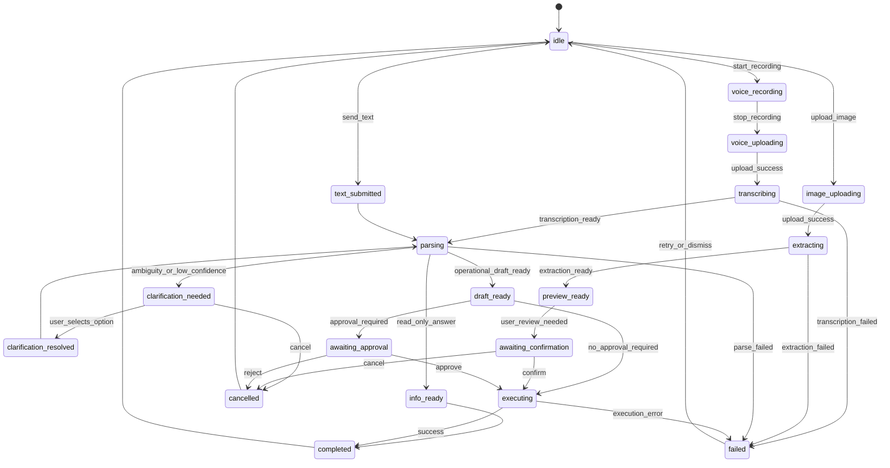
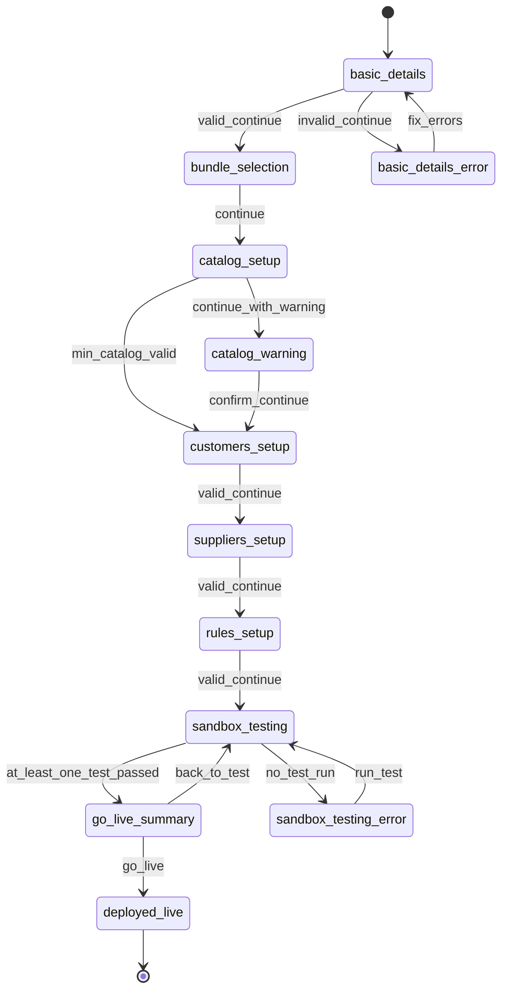
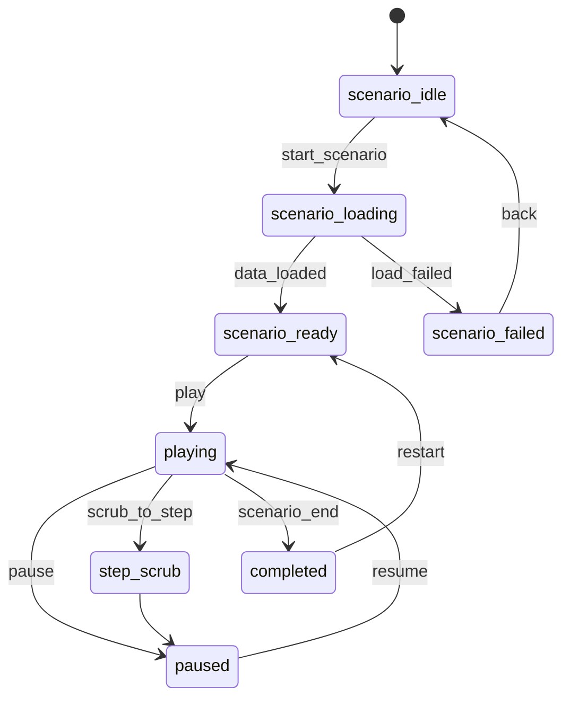
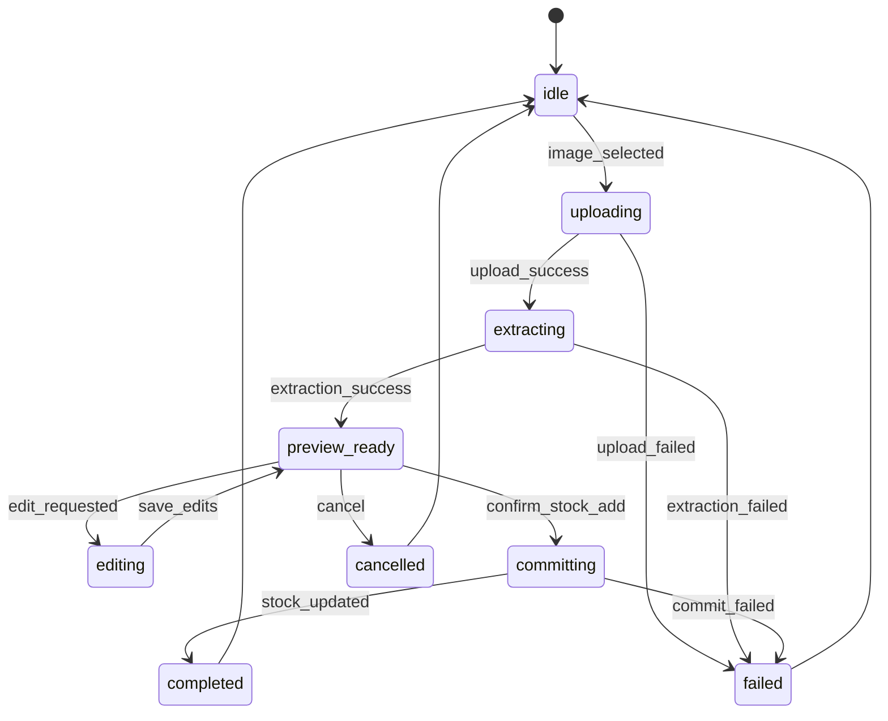
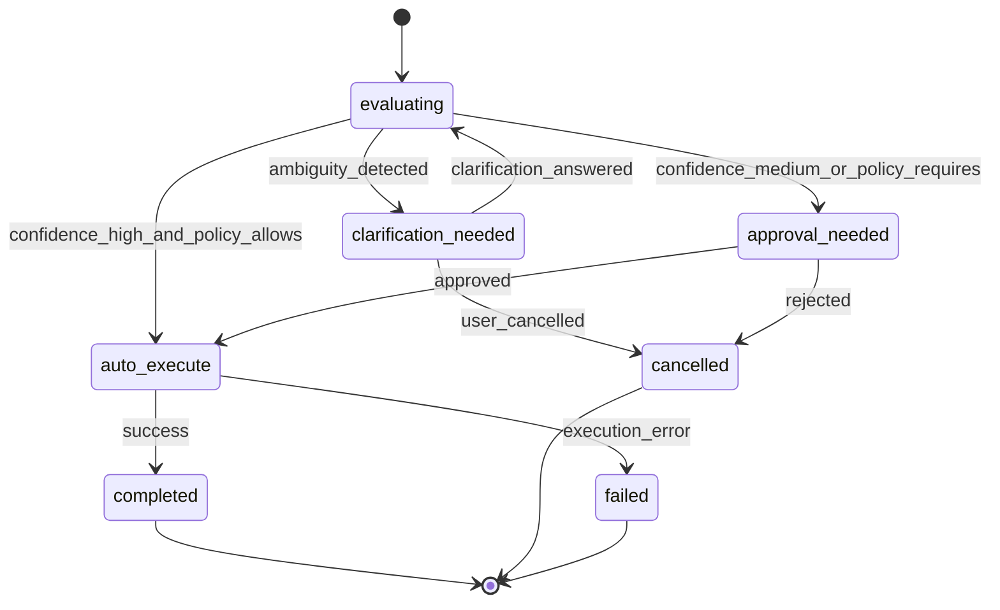

# Rupantar Horizon 1 Prototype — Developer Handoff Packet

Version: v1.0  
Artifact type: Developer handoff packet  
Scope: Kirana-first Horizon 1 prototype  
Format: Markdown  
Status: Prototype-focused, not production-ready

---

# 1. Purpose of this document

This document is the engineering handoff for the **Rupantar Horizon 1 Prototype — Kirana Ops**.

It is designed to help a product, design, and engineering team build a believable prototype that proves the core Horizon 1 claims:

1. a shopkeeper can operate through a **WhatsApp-like, voice-first interface**,  
2. a partner can **configure and deploy** the solution quickly,  
3. the system behaves like an **operational assistant**, not a generic chatbot, and  
4. the prototype is honest about what is **real**, **AI-assisted**, and **simulated**.

This packet includes:
- system architecture for the prototype
- service boundaries
- recommended tech stack
- **API contracts**
- **frontend state machine diagrams**
- backend event and state flow guidance
- real vs simulated split
- development sequencing
- QA and demo-readiness notes

This is intentionally optimized for a **Horizon 1 kirana wedge**, not the full future platform.

---

# 2. Product scope recap

## 2.1 Included in prototype

### Shopkeeper experience
- WhatsApp-like thread
- text messages
- voice note upload / simulation
- image upload for invoice/photo extraction
- bill creation and approval
- stock query
- khata/payment update
- reorder suggestion and approval
- daily summary
- ambiguity clarification

### Partner experience
- create shop
- select kirana bundle
- upload / enter product catalog
- add customers and khata balances
- add suppliers and reorder thresholds
- configure language, tone, and trust rules
- sandbox test
- go live
- view shop health
- edit context and memory
- review exceptions

### Observer experience
- side-by-side live demo canvas
- audit trail
- memory inspector
- before vs after value view
- real vs simulated transparency panel

### Internal / admin experience
- session replay
- demo state reset

## 2.2 Not included in prototype
- full 160+ agent library
- multi-vertical depth
- production WhatsApp API integration
- live UPI/payment reconciliation
- real supplier ordering
- full offline sync engine
- SDK / marketplace
- production-grade observability pipeline
- real ONDC/ABDM/GST integrations

---

# 3. Prototype architecture overview

## 3.1 High-level architecture goals

The architecture should support:
- deterministic demo flows
- enough real state to feel credible
- controlled AI assistance with guardrails
- clear distinction between stateful business logic and simulated integrations
- fast local/demo deployment

## 3.2 Recommended architecture shape



## 3.3 Core runtime principle

The prototype should use a **hybrid architecture**:
- **real stateful business logic** for shop records and flows
- **AI-assisted parsing** for language/photo interpretation
- **simulated external delivery/integration** for risky or time-consuming external dependencies

This balance is critical. If everything is simulated, the prototype feels fake. If everything is fully real, build time explodes.

---

# 4. Recommended tech stack

The goal is speed, clarity, and demo reliability.

## 4.1 Frontend

### Recommended
- **Next.js** (App Router) or **React + Vite**
- **TypeScript**
- **Tailwind CSS** for fast UI assembly
- **Zustand** or **Redux Toolkit** for app state
- **React Query / TanStack Query** for API state
- **React Hook Form + Zod** for partner forms
- **Mermaid** support for internal docs only, not required inside app

### Why
- rapid iteration
- easy role-based surfaces
- good local/demo deployment
- strong form handling for partner wizard

## 4.2 Backend

### Recommended
- **Node.js + TypeScript**
- **NestJS** or **Express/Fastify**
- **Zod** or **TypeBox** for runtime validation
- **Prisma ORM**
- **SQLite** for local prototype or **PostgreSQL** for team-shared demo

### Why
- consistent full-stack TypeScript
- schema-driven contracts
- easy seed/reset logic

## 4.3 Storage

### Recommended
- **PostgreSQL** if multiple users will collaborate or demo remotely
- **SQLite** if this is mostly local and speed matters more
- Object storage can be mocked locally for image uploads

## 4.4 AI / extraction layer

For prototype, keep adapters swappable.

### Recommended abstraction
Create provider wrappers:
- `transcribeVoice(input)`
- `extractInvoiceItems(image)`
- `detectIntent(input, context)`
- `generateSummary(dayState)`

### Recommended implementation for prototype
- real API calls where convenient
- fallback mock responses for seeded scenarios
- deterministic fixtures for investor demos

## 4.5 Auth

Prototype-level auth only.

### Recommended
- static role switch in demo mode
- optional simple session auth for partner/admin if needed

## 4.6 Observability

### Prototype level
- structured event log table
- server console logs
- session replay endpoint

### Do not overbuild
No need for full production telemetry stack in v1.

---

# 5. Real logic vs simulated services split

This is the most important architectural boundary.

## 5.1 Real logic in v1

These should genuinely mutate state and power the prototype.

| Capability | Real in v1? | Notes |
|---|---:|---|
| Shop creation | Yes | Stateful |
| Bundle assignment | Yes | Stored in DB |
| Product catalog | Yes | CRUD |
| Customer / khata records | Yes | CRUD + transactional updates |
| Supplier records | Yes | CRUD |
| Rule storage | Yes | Persisted and used in flows |
| Billing calculations | Yes | Deterministic |
| Inventory updates | Yes | Deterministic |
| Khata updates | Yes | Deterministic |
| Reorder draft generation | Yes | Deterministic rules + draft object |
| Daily summary generation | Yes | Generated from real current state |
| Audit trail | Yes | Event log persisted |
| Memory read/write | Yes | Lightweight persisted context |
| Session replay | Yes | Reconstruct from events + state |

## 5.2 AI-assisted / hybrid in v1

| Capability | Mode | Notes |
|---|---|---|
| Voice transcription | Hybrid | Real STT or deterministic fixture |
| Intent detection | Hybrid | LLM or rule-backed adapter |
| Entity extraction | Hybrid | Product/customer resolution assisted by context |
| Invoice extraction | Hybrid | OCR/vision adapter + manual correction |
| Confidence score | Hybrid | System-calculated band from adapter output |
| Summary wording | Hybrid | Generated text, but based on real numbers |

## 5.3 Simulated in v1

| Capability | Simulated? | Notes |
|---|---:|---|
| Real WhatsApp delivery | Yes | Browser chat only |
| Supplier message send | Yes | Draft and “sent” state only |
| UPI confirmation | Yes | Manual / simulated |
| Offline queue engine | Yes | Out of scope |
| Marketplace / SDK | Yes | Out of scope |
| Full multilingual speech robustness | Yes | Narrow seeded support only |
| Real partner economics tracking | Yes | Demo only |

## 5.4 Engineering rule

Whenever an external action is simulated, it must be explicit in state and audit logs.

Example statuses:
- `draft_created`
- `ready_to_send`
- `simulated_sent`
- `not_sent`

---

# 6. Service decomposition

Keep the service boundaries simple.

## 6.1 API Gateway / App Server
Responsibilities:
- auth/session context
- route handling
- request validation
- response shaping

## 6.2 Session Orchestrator
Responsibilities:
- receive incoming interaction
- call intent detector
- route to business services
- request clarification or approval when needed
- emit audit events

## 6.3 Billing Service
Responsibilities:
- build draft bill
- calculate totals
- validate products and quantities
- produce bill preview payload

## 6.4 Inventory Service
Responsibilities:
- read stock
- decrement after bill confirmation
- increment after confirmed invoice/photo extraction
- detect threshold breaches

## 6.5 Khata Service
Responsibilities:
- update credit balance after bill
- record received payments
- return current balance
- generate receipt-note drafts

## 6.6 Procurement Draft Service
Responsibilities:
- detect low stock
- map preferred supplier
- build reorder draft
- keep it pending until approval

## 6.7 Daily Summary Service
Responsibilities:
- aggregate current-day operational data
- generate summary card payload
- optionally generate voice summary text

## 6.8 Memory Resolver
Responsibilities:
- resolve aliases
- surface customer/product preferences
- store lightweight learned patterns
- explain what memory was used

## 6.9 Simulation Service
Responsibilities:
- provide deterministic fixtures for demo scenarios
- simulate WhatsApp delivery
- simulate supplier send state
- simulate external API success/failure

## 6.10 Audit Event Service
Responsibilities:
- append structured events
- support filtering by session/shop/scenario
- return replay sequences

---

# 7. API design principles

## 7.1 API style
Use simple JSON REST for v1.

Why:
- fast to implement
- easy to debug
- fine for prototype surface area

## 7.2 Response envelope
Use a standard envelope for consistency.

```json
{
  "success": true,
  "data": {},
  "meta": {
    "request_id": "req_123",
    "simulated": false
  },
  "errors": []
}
```

On failure:

```json
{
  "success": false,
  "data": null,
  "meta": {
    "request_id": "req_124",
    "simulated": false
  },
  "errors": [
    {
      "code": "PRODUCT_NOT_FOUND",
      "message": "No product matched the supplied phrase.",
      "field": "input_text"
    }
  ]
}
```

## 7.3 API versioning
Use prefix:
- `/api/v1/...`

---

# 8. API contracts

Below are the minimum contracts for v1.

---

## 8.1 Session and role APIs

### `GET /api/v1/bootstrap`
Returns app bootstrap info.

#### Response
```json
{
  "success": true,
  "data": {
    "roles": ["shopkeeper", "partner", "observer", "admin"],
    "default_shop_id": "shop_shree_ganesh_kirana",
    "default_scenarios": [
      "scenario_morning_rush_billing",
      "scenario_low_stock_reorder",
      "scenario_payment_received",
      "scenario_invoice_photo",
      "scenario_daily_summary",
      "scenario_ambiguity_customer"
    ]
  },
  "meta": {"request_id": "req_bootstrap_001", "simulated": false},
  "errors": []
}
```

---

## 8.2 Landing / scenario APIs

### `GET /api/v1/scenarios`
List all demo scenarios.

### `POST /api/v1/scenarios/:scenarioId/start`
Starts a scenario and returns seeded session state.

#### Response
```json
{
  "success": true,
  "data": {
    "scenario_id": "scenario_morning_rush_billing",
    "session_id": "sess_shop_001_20260315_101400",
    "shop_id": "shop_shree_ganesh_kirana",
    "initial_chat_state": {
      "messages": []
    }
  },
  "meta": {"request_id": "req_scn_001", "simulated": true},
  "errors": []
}
```

---

## 8.3 Partner onboarding APIs

### `POST /api/v1/shops`
Create a new shop draft.

#### Request
```json
{
  "shop_name": "Shree Ganesh Kirana",
  "owner_name": "Ramesh Patel",
  "phone_number": "+919876543210",
  "city": "Surat",
  "language": "Hinglish",
  "vertical": "kirana",
  "gst_status": "non_gst",
  "business_hours": {
    "open": "08:00",
    "close": "22:00"
  },
  "summary_time": "21:00"
}
```

#### Response
```json
{
  "success": true,
  "data": {
    "shop_id": "shop_new_001",
    "deployment_status": "draft"
  },
  "meta": {"request_id": "req_shop_001", "simulated": false},
  "errors": []
}
```

---

### `PUT /api/v1/shops/:shopId/bundle`
Assign selected bundle.

#### Request
```json
{
  "bundle": "kirana_core",
  "agents": [
    "orchestrator",
    "billing",
    "inventory",
    "khata",
    "procurement",
    "daily_summary",
    "memory"
  ]
}
```

---

### `POST /api/v1/shops/:shopId/products`
Add one or more products.

#### Request
```json
{
  "products": [
    {
      "display_name": "Regular Chawal Loose",
      "aliases": ["chawal", "regular chawal"],
      "category": "grains",
      "unit_type": "kg",
      "pack_size": "loose",
      "selling_price": 60,
      "current_stock": 42,
      "reorder_threshold": 20,
      "reorder_quantity": 50,
      "preferred_supplier_id": "sup_bharat_traders"
    }
  ]
}
```

---

### `POST /api/v1/shops/:shopId/customers`
Add one or more customers.

#### Request
```json
{
  "customers": [
    {
      "display_name": "Ram bhai",
      "aliases": ["ram"],
      "phone_number": "+919999111111",
      "credit_enabled": true,
      "outstanding_balance": 1850,
      "reminder_after_days": 7
    }
  ]
}
```

---

### `POST /api/v1/shops/:shopId/suppliers`
Add suppliers.

#### Request
```json
{
  "suppliers": [
    {
      "supplier_name": "Bharat Traders",
      "phone_number": "+918888111111",
      "categories_supplied": ["grains", "oil", "pulses"],
      "lead_time_days": 1
    }
  ]
}
```

---

### `PUT /api/v1/shops/:shopId/rules`
Save trust/language/rule configuration.

#### Request
```json
{
  "language": "Hinglish",
  "tone": "hinglish",
  "bill_approval_threshold_inr": 500,
  "reorder_requires_approval": true,
  "clarify_ambiguous_customer": true,
  "clarify_ambiguous_product": true,
  "send_daily_summary_at": "21:00"
}
```

---

### `POST /api/v1/shops/:shopId/sandbox-tests`
Run sandbox test.

#### Request
```json
{
  "test_type": "voice_bill",
  "input": "Ram ko 2 kilo chawal, 1 tel aur 3 biscuit ka bill bana do. Udhar mein daal do."
}
```

#### Response
```json
{
  "success": true,
  "data": {
    "test_result_id": "test_001",
    "status": "completed",
    "output_type": "bill_preview",
    "confidence_band": "medium",
    "agents_used": ["orchestrator", "memory", "billing", "inventory", "khata"]
  },
  "meta": {"request_id": "req_test_001", "simulated": false},
  "errors": []
}
```

---

### `POST /api/v1/shops/:shopId/deploy`
Move shop to live state.

#### Response
```json
{
  "success": true,
  "data": {
    "shop_id": "shop_new_001",
    "deployment_status": "live",
    "deployed_at": "2026-03-15T11:00:00Z"
  },
  "meta": {"request_id": "req_deploy_001", "simulated": false},
  "errors": []
}
```

---

## 8.4 Shop health / context APIs

### `GET /api/v1/shops/:shopId/health`
Returns operational dashboard info.

#### Response
```json
{
  "success": true,
  "data": {
    "bills_today": 22,
    "credit_sales_today": 2640,
    "dues_received_today": 500,
    "low_stock_alerts": 2,
    "pending_clarifications": 1,
    "pending_approvals": 1,
    "health_status": "healthy"
  },
  "meta": {"request_id": "req_health_001", "simulated": false},
  "errors": []
}
```

---

### `GET /api/v1/shops/:shopId/context`
Returns shop config plus memory.

### `PUT /api/v1/shops/:shopId/context`
Edit products/customers/suppliers/preferences.

#### Request example
```json
{
  "updates": {
    "products": [
      {
        "product_id": "prod_parle_g_small",
        "reorder_threshold": 12
      }
    ],
    "preferences": {
      "summary_time": "21:30"
    }
  }
}
```

---

## 8.5 Shopkeeper interaction APIs

### `POST /api/v1/chat/:shopId/messages/text`
Submit text input.

#### Request
```json
{
  "session_id": "sess_shop_001_20260315_101400",
  "message_text": "Ram ne 500 de diye."
}
```

#### Response
```json
{
  "success": true,
  "data": {
    "interaction_id": "int_001",
    "message_state": "received",
    "next_state": "processing"
  },
  "meta": {"request_id": "req_chat_txt_001", "simulated": false},
  "errors": []
}
```

---

### `POST /api/v1/chat/:shopId/messages/voice`
Submit voice note.

#### Request
Multipart or JSON mock in demo mode:
```json
{
  "session_id": "sess_shop_001_20260315_101400",
  "audio_ref": "voice_demo_001.wav"
}
```

#### Response
```json
{
  "success": true,
  "data": {
    "interaction_id": "int_002",
    "message_state": "transcribing"
  },
  "meta": {"request_id": "req_chat_voice_001", "simulated": true},
  "errors": []
}
```

---

### `POST /api/v1/chat/:shopId/messages/image`
Submit photo.

#### Request
```json
{
  "session_id": "sess_shop_001_20260315_101400",
  "image_ref": "invoice_photo_demo_001.jpg"
}
```

---

### `POST /api/v1/interactions/:interactionId/resolve`
Resolve pending approval/clarification.

#### Request example — approval
```json
{
  "resolution_type": "approval",
  "approved": true
}
```

#### Request example — clarification
```json
{
  "resolution_type": "clarification",
  "selected_option": "cust_ram_bhai"
}
```

---

### `GET /api/v1/chat/:shopId/sessions/:sessionId`
Return current chat state and cards.

#### Response shape
```json
{
  "success": true,
  "data": {
    "messages": [
      {
        "message_id": "msg_001",
        "sender": "assistant",
        "type": "text",
        "text": "Namaste Ramesh bhai 👋",
        "timestamp": "2026-03-15T09:00:00Z",
        "state": "shown"
      }
    ],
    "pending_cards": [],
    "session_status": "active"
  },
  "meta": {"request_id": "req_chat_session_001", "simulated": false},
  "errors": []
}
```

---

## 8.6 Observer / audit APIs

### `GET /api/v1/audit/sessions/:sessionId`
Fetch ordered event log.

### `GET /api/v1/audit/sessions/:sessionId/replay`
Return replay-optimized state frames.

#### Response
```json
{
  "success": true,
  "data": {
    "frames": [
      {
        "step": 1,
        "label": "Intent detected",
        "event_id": "evt_sample_001",
        "chat_snapshot": {},
        "state_snapshot": {},
        "observer_annotation": "Orchestrator detected billing + inventory + khata"
      }
    ]
  },
  "meta": {"request_id": "req_replay_001", "simulated": false},
  "errors": []
}
```

---

## 8.7 Demo/admin APIs

### `POST /api/v1/demo/reset`
Reset all or selected demo state.

#### Request
```json
{
  "reset_inventory": true,
  "reset_balances": true,
  "reset_chat": true,
  "reload_seed_data": true
}
```

### `POST /api/v1/demo/load-seed`
Load a named seed pack.

#### Request
```json
{
  "seed_name": "kirana_default_v1"
}
```

---

# 9. Frontend state machine diagrams

These are the most useful frontend models for engineering. Use them to drive reducers, Zustand stores, or XState if you want stricter orchestration.

---

## 9.1 Shopkeeper interaction state machine

This is the master state machine for incoming interactions.



### Notes
- `preview_ready` is mainly for image/photo extraction
- `awaiting_confirmation` is a lightweight confirmation stage
- `awaiting_approval` is for trust-critical actions
- `info_ready` is for read-only queries like balance or stock checks

---

## 9.2 Partner onboarding wizard state machine



### Notes
- keep backward navigation allowed to completed steps
- do not allow forward jumps into locked steps
- warnings should not block progression in prototype if user explicitly confirms

---

## 9.3 Observer scenario player state machine



### Notes
Useful for investor demos where timing and narrative matter.

---

## 9.4 Photo extraction state machine



---

## 9.5 Approval and clarification gate state machine



---

# 10. Frontend state containers

If using Zustand or Redux Toolkit, I recommend these stores/slices.

## 10.1 `sessionStore`
Holds runtime session state.

Fields:
- `currentRole`
- `currentScenarioId`
- `currentShopId`
- `currentSessionId`
- `chatMessages[]`
- `pendingCards[]`
- `sessionStatus`

## 10.2 `partnerWizardStore`
Holds onboarding wizard form and step status.

Fields:
- `stepStates`
- `shopDraft`
- `productsDraft[]`
- `customersDraft[]`
- `suppliersDraft[]`
- `rulesDraft`
- `sandboxTestResults[]`

## 10.3 `observerStore`
Fields:
- `selectedScenario`
- `playbackState`
- `selectedEventId`
- `showRawInput`
- `showMemory`
- `showStateChanges`

## 10.4 `auditStore`
Fields:
- `events[]`
- `replayFrames[]`
- `filters`

## 10.5 `uiStore`
Fields:
- `activeDrawer`
- `activeModal`
- `toastQueue[]`

---

# 11. Suggested backend domain model

This is a compact prototype schema.

## Core tables / entities
- `shops`
- `products`
- `customers`
- `suppliers`
- `shop_rules`
- `memory_entries`
- `sessions`
- `messages`
- `interaction_records`
- `draft_bills`
- `stock_movements`
- `khata_transactions`
- `reorder_drafts`
- `daily_summaries`
- `audit_events`
- `sandbox_tests`

## Relationships
- shop has many products/customers/suppliers/rules/memory entries/sessions
- session has many messages/interactions/audit events
- reorder draft belongs to shop and may reference multiple products
- stock movements and khata transactions should be append-only where possible

---

# 12. Error handling strategy

## 12.1 Error categories
- validation error
- parsing ambiguity
- low confidence
- business rule conflict
- state mutation failure
- simulated external dependency failure

## 12.2 UX rules for errors

### Shopkeeper
Never show technical errors like “500” or “null supplier.”
Show user-safe copy:
- “Mujhe is item ko identify karne mein issue aa raha hai.”
- “Main sure nahi hoon. Please confirm.”
- “Abhi order draft nahi bana paya. Dobara try karein.”

### Partner
Show structured actionable guidance:
- “This shop has no preferred supplier mapped for sunflower oil.”
- “At least 10 products are recommended for this demo.”

### Observer/Admin
Show raw failure reason plus user-safe message.

---

# 13. Demo reliability strategy

Prototype demos fail when AI or external dependencies are overly real. To reduce demo risk:

## 13.1 Deterministic scenario mode
Each official demo scenario should have:
- seeded input
- seeded expected parsing
- seeded expected card output
- seeded audit sequence

## 13.2 Hybrid fallback mode
If live AI call fails:
- use deterministic fixture
- keep UI flow intact
- log `simulated=true`

## 13.3 Replay-first architecture
Every important scenario should be replayable from stored events and state.

---

# 14. Build sequence recommendation

## Phase 1 — core shell
- role selector
- scenario launcher
- desktop shell
- mobile chat shell
- seed loader

## Phase 2 — stateful business logic
- shops/products/customers/suppliers CRUD
- billing calculation
- inventory mutation
- khata mutation
- reorder draft generation
- daily summary calculation

## Phase 3 — partner flow
- onboarding wizard
- sandbox tests
- go live flow
- health dashboard
- edit context

## Phase 4 — shopkeeper flow
- chat message pipeline
- voice/image adapters
- card rendering
- clarification / approval flow

## Phase 5 — observer/admin
- live canvas
- audit logs
- replay
- transparency panel
- reset tools

## Phase 6 — polish
- seeded scenarios
- realistic copy
- fallback fixtures
- UI consistency

---

# 15. QA checklist

## 15.1 Shopkeeper flow QA
- voice note leads to bill preview
- confirmation updates state
- stock decrement is visible
- khata update is visible
- low stock triggers reorder suggestion
- ambiguity triggers clarification instead of guessing
- photo extraction can be edited before commit
- summary reflects current data

## 15.2 Partner flow QA
- cannot go live without minimum valid setup
- warnings appear when setup is shallow
- sandbox tests do not mutate live state
- context edits can be pushed live
- health dashboard reflects state changes

## 15.3 Observer QA
- every scenario has coherent audit sequence
- memory inspector matches actual context used
- transparency panel correctly flags simulated actions
- replay reconstructs visible state in order

## 15.4 Admin QA
- reset restores baseline seed state
- seed load switches shops cleanly
- old session data does not leak after reset

---

# 16. Security / privacy note for prototype

This is a prototype, but still treat shop and customer records with care.

## Minimum practices
- no real personal data in shared demo environments unless approved
- use seeded or masked phone numbers where possible
- label demo data clearly
- do not expose raw internal event payloads to non-admin users

---

# 17. Open engineering decisions

These should be resolved before implementation starts.

1. **Frontend framework**: Next.js or React+Vite?
2. **State approach**: Zustand or Redux Toolkit or XState for key flows?
3. **DB choice**: SQLite for speed or PostgreSQL for team demos?
4. **Voice/image adapters**: real API now, or fixture-first?
5. **Replay model**: derive from audit events only, or store denormalized frames?
6. **Deployment target**: local demo, Vercel, internal environment?
7. **Auth**: no-auth demo mode or lightweight sign-in for partner/admin?

---

# 18. Definition of done for prototype engineering

The prototype is ready when all of the following are true:

## Product truth
- A shopkeeper can complete the main billing/stock/khata/summary flows through the chat interface.
- A partner can configure a shop in one sitting.
- An observer can explain the internal logic after one walkthrough.

## Engineering truth
- Core business records are stateful.
- Audit events exist for every major action.
- Real vs simulated boundaries are explicit.
- Every seeded scenario can run end-to-end without manual patching.

## Demo truth
- There is a reliable 5-minute demo.
- There is a reliable 15-minute deep dive.
- There is at least one ambiguity/failure recovery scenario.

---

# 19. Recommended deliverables for the engineering team

The engineering team should produce these artifacts from this handoff:

1. API implementation task list
2. DB schema / Prisma schema
3. Frontend route map
4. Store/state machine implementation plan
5. Seed script
6. Scenario fixture library
7. Audit event logger utility
8. Demo reset utility
9. Production-risk backlog for anything currently simulated

---

# 20. Download structure recommendation

If you keep this in the same doc bundle as the earlier planning docs, use:

- `00_README.md`
- `01_horizon1_prototype_scope.md`
- `02_prototype_blueprint.md`
- `03_wireframe_spec.md`
- `04_component_inventory_and_interaction_spec.md`
- `05_developer_handoff_packet.md`

---

# 21. Final engineering guidance

If there is one principle to keep during implementation, it is this:

**Treat the prototype like a narrow but real operational system, not a visual demo of AI.**

That means:
- keep kirana deep, not broad
- make state changes real
- keep external dependencies simulated when needed
- show trust through approvals, clarifications, and logs
- make partner setup feel repeatable

That is what will make Horizon 1 believable.
